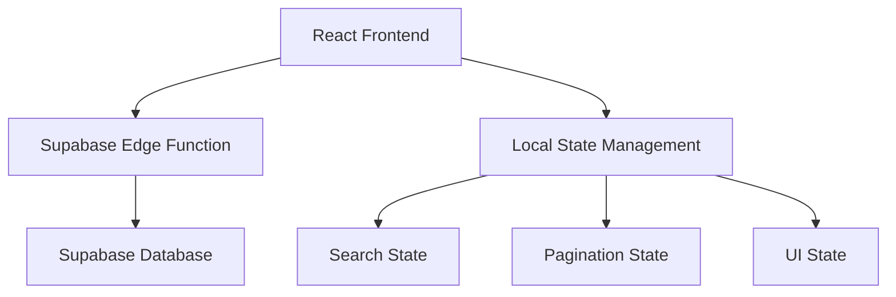

# Design Document

## Overview

The Azerbaijan Drug Database is a React-based web application that provides a public interface for searching and browsing pharmaceutical data. The application connects to an existing Supabase backend through edge functions and displays comprehensive drug information in a user-friendly table format with search, pagination, and filtering capabilities.

The application will be built as a single-page application (SPA) using React 19, with a clean and responsive design that works across desktop and mobile devices. The interface will prioritize usability for the general public, requiring no authentication or technical expertise.

## Architecture

### High-Level Architecture



### Technology Stack

- **Frontend Framework**: React 19
- **Backend**: Supabase (existing)
- **API Communication**: Supabase JavaScript Client
- **Styling**: CSS3 with responsive design and CSS modules
- **State Management**: React useState hooks with React 19 optimizations
- **Build Tool**: Vite (modern and optimized for React 19)
- **Compiler**: React Compiler (automatic optimization)

### Data Flow

1. **Initial Load**: Application loads and fetches first page of all available drugs (empty search term)
2. **Search Flow**: User input triggers debounced API calls to Supabase edge function with search term and pagination parameters
3. **Display Flow**: Results are received with pagination metadata and rendered in table format
4. **Pagination Flow**: Server-side pagination handles large result sets, client manages page navigation

## Components and Interfaces

### Component Hierarchy

```
App
├── SearchBar
├── ResultsInfo
├── DrugTable
│   ├── TableHeader
│   ├── TableBody
│   │   └── DrugRow (multiple)
│   └── TableFooter
└── Pagination
    ├── PageSizeSelector
    ├── PageNavigation
    └── PageInfo
```

### Core Components

#### App Component
- **Purpose**: Main application container and state management with React 19 optimizations
- **State** (using React 19 optimized useState): 
  - `drugs`: Array of current page drug data
  - `searchText`: Current search input (with automatic batching)
  - `loading`: Loading state with Suspense integration
  - `error`: Error state with Error Boundary support
  - `currentPage`: Current pagination page
  - `pageSize`: Items per page
  - `totalCount`: Total number of results from server
  - `totalPages`: Total number of pages from server
- **Hooks**:
  - `useActionState`: For search form actions and transitions
  - `useOptimistic`: For optimistic UI updates during search and pagination
  - `useDeferredValue`: For non-urgent search updates
  - `useTransition`: For smooth page transitions
- **Methods**:
  - `fetchDrugs()`: Load drugs with server-side pagination and search
  - `handleSearch()`: Trigger search with server-side filtering
  - `handlePageChange()`: Update current page and fetch new data
  - `handlePageSizeChange()`: Update page size and fetch new data

#### SearchBar Component
- **Props**: `searchText`, `onSearchChange`, `loading`, `isPending`
- **Features**:
  - React 19 form actions for better UX
  - Automatic debouncing with useDeferredValue
  - Clear button functionality with useTransition
  - Loading state indication with Suspense
  - Responsive design with CSS modules
  - Optimistic updates for immediate feedback

#### ResultsInfo Component
- **Props**: `totalCount`, `currentPage`, `pageSize`, `searchText`
- **Features**:
  - Display total count of items
  - Show current page range
  - Indicate search vs. browse mode

#### DrugTable Component
- **Props**: `drugs`, `loading`, `isPending`, `visibleColumns`, `onColumnToggle`
- **Features**:
  - Responsive table layout with CSS Grid
  - Fixed header with scrollable body
  - Column sorting with useTransition for smooth updates
  - Mobile-friendly responsive design
  - Virtual scrolling for large datasets (React 19 optimized)
  - Automatic memoization with React Compiler
  - Suspense boundaries for progressive loading
  - Integrated column selector for customizable table display

#### ColumnSelector Component
- **Props**: `columns`, `visibleColumns`, `onColumnToggle`, `disabled`
- **Features**:
  - Dropdown interface with gear icon and column count display
  - Checkbox list for individual column toggle
  - "Show All" and "Hide Optional" action buttons
  - Required column protection (cannot be hidden)
  - Keyboard navigation and accessibility support
  - Responsive design with mobile adaptations
  - Loading state handling

#### DrugRow Component
- **Props**: `drug`
- **Features**:
  - Format prices in AZN (₼XX.XX)
  - Handle long text truncation
  - Responsive cell layout

#### Pagination Component
- **Props**: `currentPage`, `totalPages`, `pageSize`, `onPageChange`, `onPageSizeChange`, `isPending`
- **Features**:
  - Page navigation with form actions for better accessibility
  - Page size selector (10, 25, 50, 100) with useTransition
  - Current page indicator with optimistic updates
  - Responsive design with CSS modules
  - Smooth transitions between pages
  - Automatic batching for mul

### API Interface

#### Supabase Configuration
```javascript
const supabaseConfig = {
  url: "https://uxmvulvmvtismnokxsry.supabase.co",
  key: "eyJhbGciOiJIUzI1NiIsInR5cCI6IkpXVCJ9..."
}
```

#### Edge Function Interface
```javascript
// Search/Fetch Function with Server-Side Pagination
const response = await supabase.functions.invoke('database-search', {
  body: JSON.stringify({ 
    p_search_term: string,    // Required - search term (empty string for all results)
    p_page_number: number,    // Optional - defaults to 1 in DB
    p_page_size: number       // Optional - defaults to 10 in DB
  })
});

// Response Format
{
  data: [
    {
      number: number,
      product_name: string,
      active_ingredients: string,
      dosage_amount: string,
      dosage_form: string,
      packaging_form: string,
      amount: string,
      manufacturer: string,
      wholesale_price: number, // in qəpik (1/100 AZN)
      retail_price: number,    // in qəpik (1/100 AZN)
      date: string
    }
  ],
  total_count: number,        // Total number of results for pagination
  page_number: number,        // Current page number
  page_size: number,          // Items per page
  total_pages: number         // Total number of pages
}
```

## React 19 Implementation Details

### Key React 19 Features Utilized

#### 1. React Compiler
- **Automatic Optimization**: Components and hooks are automatically optimized
- **Memoization**: Eliminates need for manual useMemo and useCallback
- **Performance**: Significant performance improvements without code changes

#### 2. Enhanced Hooks

**useActionState**
```javascript
// For search form handling with server-side pagination
const [searchState, searchAction, isPending] = useActionState(
  async (prevState, formData) => {
    const searchText = formData.get('search');
    const pageSize = formData.get('pageSize') || 10;
    return await performSearch(searchText, 1, pageSize); // Reset to page 1 on new search
  },
  { results: [], totalCount: 0, currentPage: 1, totalPages: 0, error: null }
);
```

**useOptimistic**
```javascript
// For immediate UI feedback during search
const [optimisticResults, addOptimisticResult] = useOptimistic(
  searchResults,
  (state, newSearch) => ({ ...state, loading: true, query: newSearch })
);
```

**useDeferredValue**
```javascript
// For non-urgent search updates
const deferredSearchText = useDeferredValue(searchText);
```

**useTransition**
```javascript
// For smooth page transitions
const [isPending, startTransition] = useTransition();

const handlePageChange = (newPage) => {
  startTransition(() => {
    setCurrentPage(newPage);
  });
};
```

#### 3. Form Actions
```javascript
// Enhanced form handling
<form action={searchAction}>
  <input name="search" type="text" />
  <button type="submit" disabled={isPending}>
    {isPending ? 'Searching...' : 'Search'}
  </button>
</form>
```

#### 4. Enhanced Suspense
```javascript
// Progressive loading with better error boundaries
<Suspense fallback={<TableSkeleton />}>
  <DrugTable drugs={drugs} />
</Suspense>
```

### Project Setup

1. **Initial Setup**
   ```bash
   npm create vite@latest azerbaijan-drug-database -- --template react
   cd azerbaijan-drug-database
   npm install react@19 react-dom@19
   npm install @supabase/supabase-js
   npm install --save-dev @babel/plugin-react-compiler
   ```

2. **Vite and Compiler Configuration**
   ```javascript
   // vite.config.js
   import { defineConfig } from 'vite'
   import react from '@vitejs/plugin-react'
   
   export default defineConfig({
     plugins: [
       react({
         babel: {
           plugins: [
             ['@babel/plugin-react-compiler', { target: '19' }]
           ]
         }
       })
     ]
   })
   ```

3. **Project Structure**
   ```
   src/
   ├── components/
   │   ├── SearchBar/
   │   ├── DrugTable/
   │   ├── Pagination/
   │   └── ResultsInfo/
   ├── hooks/
   ├── utils/
 

## Data Models

### Drug Model
```typescript
interface Drug {
  number: number;           // Registration number
  product_name: string;     // Product name
  active_ingredients: string; // Active ingredients (comma-separated)
  dosage_amount: string;    // Dosage with units
  dosage_form: string;      // Formulation (tablet, injection, etc.)
  packaging_form: string;   // Packaging description
  amount: string;           // Amount
  manufacturer: string;     // Manufacturer name and country
  wholesale_price: number;  // Price in qəpik
  retail_price: number;     // Price in qəpik
  date: string;            // Registration/update date
}
```

### Application State Model
```typescript
interface AppState {
  drugs: Drug[];
  searchText: string;
  loading: boolean;
  error: string | null;
  currentPage: number;
  pageSize: number;
  totalCount: number;
  totalPages: number;
}

interface PaginationResponse {
  data: Drug[];
  total_count: number;
  page_number: number;
  page_size: number;
  total_pages: number;
}
```

## Error Handling

### Error Types and Handling

1. **Network Errors**
   - Display: "Unable to connect to the database. Please check your internet connection."
   - Action: Provide retry button

2. **API Errors**
   - Display: "An error occurred while searching. Please try again."
   - Action: Log error details, show retry option

3. **Timeout Errors**
   - Display: "The request is taking longer than expected. Please try again."
   - Action: Implement 30-second timeout with retry

4. **Data Format Errors**
   - Display: "Unable to display results. Please refresh the page."
   - Action: Log error, provide page refresh option

### Error Recovery
- Automatic retry for transient errors (3 attempts)
- Graceful degradation when partial data is available
- Clear error messages in simple language
- Persistent error logging for debugging

## Testing Strategy

### Unit Testing
- **Components**: Test each component in isolation
- **Utilities**: Test price formatting, search filtering
- **API Integration**: Mock Supabase calls for testing

### Integration Testing
- **Search Flow**: End-to-end search functionality
- **Pagination**: Complete pagination workflow
- **Error Handling**: Various error scenarios

### User Acceptance Testing
- **Usability**: Test with non-technical users
- **Performance**: Load testing with large datasets
- **Accessibility**: Screen reader and keyboard navigation
- **Responsive Design**: Testing across device sizes

### Testing Tools
- **Jest**: Unit and integration testing
- **React Testing Library**: Component testing
- **MSW (Mock Service Worker)**: API mocking
- **Cypress**: End-to-end testing (optional)

## Performance Considerations

### React 19 Optimization Strategies

1. **Automatic Optimizations**
   - React Compiler automatically optimizes components and hooks
   - Automatic memoization eliminates need for manual React.memo
   - Improved concurrent rendering for smoother user experience

2. **Data Loading & State Management**
   - Server-side pagination reduces client-side data processing
   - useDeferredValue for non-urgent search updates
   - useTransition for smooth page transitions and API calls
   - useOptimistic for immediate UI feedback during pagination
   - Automatic batching for multiple state updates

3. **Rendering Optimization**
   - Enhanced Suspense for progressive loading
   - Improved hydration for faster initial render
   - Virtual scrolling with React 19 concurrent features
   - CSS modules for better style performance

4. **Memory Management**
   - Improved garbage collection with React 19
   - Better cleanup of concurrent operations
   - Optimized event handling with form actions

5. **Network Optimization**
   - Server-side pagination reduces data transfer
   - Efficient API calls with search and pagination parameters
   - Better error boundaries with enhanced error handling
   - Optimized bundle size with improved tree shaking

## Security Considerations

### Data Protection
- Use read-only Supabase API key
- No sensitive data storage in frontend
- Proper error message sanitization

### API Security
- Rate limiting handled by Supabase
- No authentication required (public data)
- Input sanitization for search queries

## Accessibility Features

### WCAG 2.1 Compliance
- Proper semantic HTML structure
- ARIA labels for interactive elements
- Keyboard navigation support
- Screen reader compatibility
- High contrast color scheme
- Responsive text sizing

### Implementation Details
- Table headers with proper scope attributes
- Skip navigation links
- Focus management for pagination
- Alternative text for loading states
- Error announcements for screen readers

## Responsive Design

### Breakpoints
- **Mobile**: < 768px
- **Tablet**: 768px - 1024px
- **Desktop**: > 1024px

### Mobile Adaptations
- Horizontal scrolling for table
- Stacked layout for search and pagination
- Touch-friendly button sizes
- Optimized font sizes

### Table Responsiveness
- Fixed table headers
- Horizontal scroll with sticky columns
- Collapsible columns on mobile
- Alternative card view for very small screens (optional)

## Deployment Considerations

### Build Configuration
- React 19 production optimizations
- React Compiler integration for automatic optimization
- Environment variable management
- Static asset optimization with improved bundling
- Bundle size analysis with React 19 improvements
- Enhanced tree shaking and dead code elimination

### Hosting Requirements
- Static hosting (Netlify, Vercel, or similar)
- HTTPS support
- CDN for global performance
- Proper caching headers

### Monitoring
- Error tracking (optional)
- Performance monitoring
- Usage analytics (optional)
- Uptime monitoring