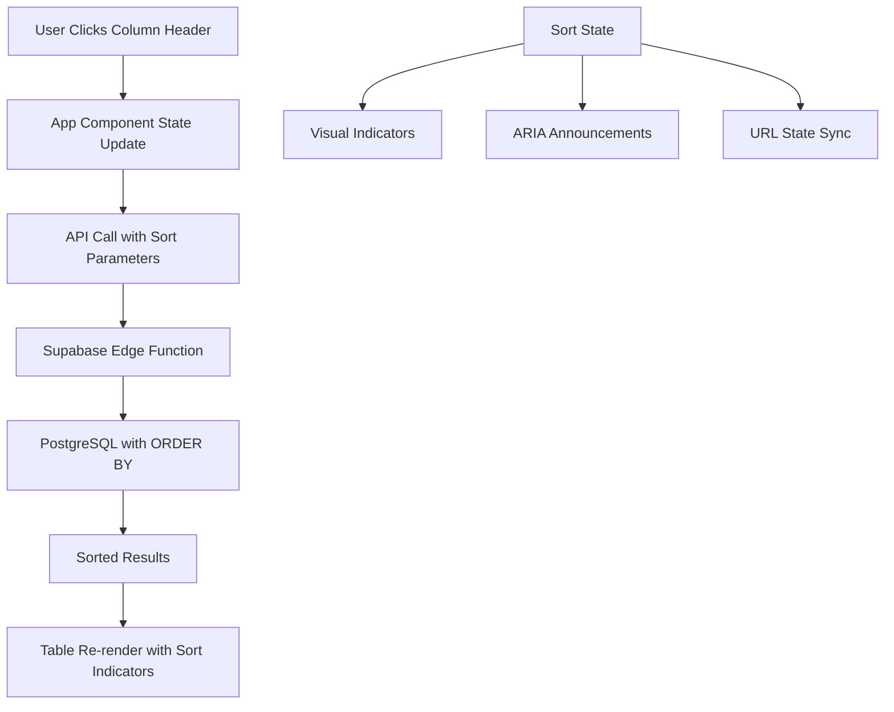

# Design Document

## Overview

The Column Sorting feature enhances the existing Azerbaijan Drug Database table by adding interactive sorting functionality. Users can click on column headers to sort data by that column, with visual indicators showing the current sort state. The feature integrates seamlessly with existing functionality including search, pagination, and column visibility controls.

The implementation leverages React 19 features for optimal performance and maintains server-side sorting to handle large datasets efficiently. The design prioritizes accessibility, responsive behavior, and intuitive user experience.

## Architecture

### High-Level Architecture



### Technology Integration

- **React 19 Features**: useTransition for smooth sorting, useOptimistic for immediate feedback
- **Server-Side Sorting**: PostgreSQL ORDER BY clauses via Supabase edge function
- **State Management**: Integrated with existing App component state
- **Accessibility**: ARIA attributes and screen reader announcements
- **Performance**: Debounced updates and optimistic UI

## Components and Interfaces

### Enhanced DrugTable Component

#### New Props
```javascript
{
  // Existing props...
  sortColumn: string | null,        // Currently sorted column key
  sortDirection: 'asc' | 'desc',    // Current sort direction
  onSort: (column: string) => void  // Sort handler function
}
```

#### Updated TableHeader Component
```javascript
function TableHeader({ 
  visibleColumns, 
  sortColumn, 
  sortDirection, 
  onSort 
}) {
  return (
    <thead className={styles.tableHeader}>
      <tr>
        {SORTABLE_COLUMNS.map(column => (
          <SortableColumnHeader
            key={column.key}
            column={column}
            isVisible={visibleColumns[column.key]}
            isSorted={sortColumn === column.key}
            sortDirection={sortDirection}
            onSort={onSort}
          />
        ))}
      </tr>
    </thead>
  )
}
```

#### New SortableColumnHeader Component
```javascript
function SortableColumnHeader({ 
  column, 
  isVisible, 
  isSorted, 
  sortDirection, 
  onSort 
}) {
  if (!isVisible) return null

  const handleClick = () => {
    onSort(column.key)
  }

  const handleKeyDown = (e) => {
    if (e.key === 'Enter' || e.key === ' ') {
      e.preventDefault()
      onSort(column.key)
    }
  }

  return (
    <th 
      scope="col" 
      className={`${styles.headerCell} ${styles.sortableHeader}`}
      onClick={handleClick}
      onKeyDown={handleKeyDown}
      tabIndex="0"
      role="columnheader"
      aria-sort={
        isSorted 
          ? (sortDirection === 'asc' ? 'ascending' : 'descending')
          : 'none'
      }
      aria-label={`${column.label}, ${
        isSorted 
          ? `sorted ${sortDirection === 'asc' ? 'ascending' : 'descending'}, click to sort ${sortDirection === 'asc' ? 'descending' : 'ascending'}`
          : 'not sorted, click to sort ascending'
      }`}
    >
      <div className={styles.headerContent}>
        <span className={styles.headerText}>{column.label}</span>
        <SortIndicator 
          isSorted={isSorted} 
          direction={sortDirection} 
        />
      </div>
    </th>
  )
}
```

#### New SortIndicator Component
```javascript
function SortIndicator({ isSorted, direction }) {
  if (!isSorted) {
    return (
      <span className={styles.sortIndicator} aria-hidden="true">
        <span className={styles.sortIconNeutral}>⇅</span>
      </span>
    )
  }

  return (
    <span className={styles.sortIndicator} aria-hidden="true">
      {direction === 'asc' ? (
        <span className={styles.sortIconAsc}>↑</span>
      ) : (
        <span className={styles.sortIconDesc}>↓</span>
      )}
    </span>
  )
}
```

### Enhanced App Component State

#### New State Variables
```javascript
const [sortColumn, setSortColumn] = useState(null)
const [sortDirection, setSortDirection] = useState('asc')
```

#### Enhanced Search Function
```javascript
const performSearch = async (searchTerm, page, size, orderBy = null, orderDir = 'asc') => {
  // ... existing code ...
  
  const response = await optimizedSearchDrugs(searchTerm, page, size, orderBy, orderDir)
  
  // ... existing code ...
}
```

#### New Sort Handler
```javascript
const handleSort = (columnKey) => {
  performanceMonitor.measureConcurrentFeature('column-sort', () => {
    startTransition(() => {
      // Determine new sort direction
      const newDirection = (sortColumn === columnKey && sortDirection === 'asc') 
        ? 'desc' 
        : 'asc'
      
      // Add optimistic update
      addOptimisticUpdate({
        type: 'SORT_CHANGE',
        column: columnKey,
        direction: newDirection
      })
      
      // Update state
      setSortColumn(columnKey)
      setSortDirection(newDirection)
      setCurrentPage(1) // Reset to first page
      
      // Perform search with sort parameters
      performSearch(searchText, 1, pageSize, columnKey, newDirection)
    })
  })
}
```

### Enhanced API Integration

#### Updated Supabase Service
```javascript
export const searchDrugs = async (
  searchTerm = '', 
  pageNumber = 1, 
  pageSize = 10,
  orderBy = null,
  orderDirection = 'asc'
) => {
  const requestBody = {
    p_search_term: processedSearchTerm,
    p_page_number: pageNumber,
    p_page_size: pageSize,
    p_order_by: orderBy,
    p_order_dir: orderDirection
  }
  
  // ... rest of function ...
}
```

#### Edge Function Parameters
The existing edge function already supports these parameters:
- `p_order_by`: Column name to sort by
- `p_order_dir`: Sort direction ('asc' or 'desc')

## Data Models

### Sort Configuration
```javascript
const SORTABLE_COLUMNS = [
  {
    key: 'number',
    label: 'Registration #',
    type: 'numeric',
    sortable: true
  },
  {
    key: 'product_name',
    label: 'Product Name',
    type: 'text',
    sortable: true
  },
  {
    key: 'active_ingredients',
    label: 'Active Ingredients',
    type: 'text',
    sortable: true
  },
  {
    key: 'dosage_amount',
    label: 'Dosage',
    type: 'alphanumeric',
    sortable: true
  },
  {
    key: 'dosage_form',
    label: 'Formulation',
    type: 'text',
    sortable: true
  },
  {
    key: 'packaging_form',
    label: 'Packaging Form',
    type: 'text',
    sortable: false // Too varied to be useful
  },
  {
    key: 'amount',
    label: 'Amount',
    type: 'alphanumeric',
    sortable: true
  },
  {
    key: 'manufacturer',
    label: 'Manufacturer',
    type: 'text',
    sortable: true
  },
  {
    key: 'wholesale_price',
    label: 'Wholesale Price',
    type: 'numeric',
    sortable: true
  },
  {
    key: 'retail_price',
    label: 'Retail Price',
    type: 'numeric',
    sortable: true
  },
  {
    key: 'date',
    label: 'Registration Date',
    type: 'date',
    sortable: true
  }
]
```

### Enhanced App State
```javascript
interface AppState {
  // Existing state...
  drugs: Drug[]
  searchText: string
  loading: boolean
  error: string | null
  currentPage: number
  pageSize: number
  totalCount: number
  totalPages: number
  visibleColumns: Record<string, boolean>
  
  // New sorting state
  sortColumn: string | null
  sortDirection: 'asc' | 'desc'
}
```

## Styling and Visual Design

### CSS Classes for Sorting

```css
/* Sortable header styles */
.sortableHeader {
  cursor: pointer;
  user-select: none;
  transition: background-color 0.15s ease;
  position: relative;
}

.sortableHeader:hover {
  background-color: rgba(255, 255, 255, 0.1);
}

.sortableHeader:focus {
  outline: 2px solid rgba(255, 255, 255, 0.8);
  outline-offset: -2px;
}

.headerContent {
  display: flex;
  align-items: center;
  justify-content: space-between;
  gap: 0.5rem;
}

.headerText {
  flex: 1;
  min-width: 0;
}

/* Sort indicator styles */
.sortIndicator {
  display: inline-flex;
  align-items: center;
  justify-content: center;
  width: 1rem;
  height: 1rem;
  font-size: 0.875rem;
  opacity: 0.8;
  transition: opacity 0.15s ease;
}

.sortableHeader:hover .sortIndicator {
  opacity: 1;
}

.sortIconNeutral {
  color: rgba(255, 255, 255, 0.6);
  font-size: 0.75rem;
}

.sortIconAsc,
.sortIconDesc {
  color: white;
  font-weight: bold;
  font-size: 0.875rem;
}

.sortIconAsc {
  transform: translateY(-1px);
}

.sortIconDesc {
  transform: translateY(1px);
}

/* Loading state for sorted column */
.sortableHeader.loading {
  opacity: 0.7;
  pointer-events: none;
}

.sortableHeader.loading .sortIndicator {
  animation: pulse 1.5s ease-in-out infinite;
}

@keyframes pulse {
  0%, 100% { opacity: 0.6; }
  50% { opacity: 1; }
}
```

### Responsive Design Considerations

```css
/* Mobile adaptations */
@media (max-width: 768px) {
  .headerContent {
    gap: 0.25rem;
  }
  
  .sortIndicator {
    width: 0.875rem;
    height: 0.875rem;
    font-size: 0.75rem;
  }
  
  .sortIconAsc,
  .sortIconDesc {
    font-size: 0.75rem;
  }
}

/* High contrast mode */
@media (prefers-contrast: high) {
  .sortableHeader:focus {
    outline: 3px solid white;
  }
  
  .sortIconAsc,
  .sortIconDesc {
    color: white;
    text-shadow: 1px 1px 0 black;
  }
}
```

## React 19 Implementation Details

### Enhanced useOptimistic Integration

```javascript
const [optimisticState, addOptimisticUpdate] = useOptimistic(
  {
    // ... existing state
    sortColumn,
    sortDirection,
    loading: loading || isPending
  },
  (state, action) => {
    switch (action.type) {
      case 'SORT_CHANGE':
        return {
          ...state,
          sortColumn: action.column,
          sortDirection: action.direction,
          loading: true,
          currentPage: 1
        }
      // ... existing cases
    }
  }
)
```

### Performance Optimizations

```javascript
// Memoized sort handler to prevent unnecessary re-renders
const handleSort = useCallback((columnKey) => {
  // ... sort logic
}, [sortColumn, sortDirection, searchText, pageSize])

// Optimized column header rendering
const SortableColumnHeader = memo(({ 
  column, 
  isVisible, 
  isSorted, 
  sortDirection, 
  onSort 
}) => {
  // ... component logic
})
```

## Error Handling

### Sort-Specific Error Handling

```javascript
const handleSort = (columnKey) => {
  try {
    // Validate column is sortable
    const column = SORTABLE_COLUMNS.find(col => col.key === columnKey)
    if (!column || !column.sortable) {
      throw new Error(`Column ${columnKey} is not sortable`)
    }
    
    // ... rest of sort logic
    
  } catch (error) {
    errorLogger.logError(error, {
      type: 'SORT_ERROR',
      operation: 'handleSort',
      columnKey,
      currentSort: { sortColumn, sortDirection }
    })
    
    // Show user-friendly error
    setError('Unable to sort by this column. Please try again.')
  }
}
```

### API Error Recovery

```javascript
// If sort fails, maintain previous sort state
const performSearch = async (searchTerm, page, size, orderBy, orderDir) => {
  const previousSort = { column: sortColumn, direction: sortDirection }
  
  try {
    // ... API call
  } catch (error) {
    // Restore previous sort state on error
    setSortColumn(previousSort.column)
    setSortDirection(previousSort.direction)
    throw error
  }
}
```

## Accessibility Features

### ARIA Implementation

```javascript
// Column header ARIA attributes
<th 
  aria-sort={
    isSorted 
      ? (sortDirection === 'asc' ? 'ascending' : 'descending')
      : 'none'
  }
  aria-label={`${column.label}, ${getSortAriaLabel(isSorted, sortDirection)}`}
  role="columnheader"
  tabIndex="0"
>
```

### Screen Reader Announcements

```javascript
// Live region for sort changes
<div 
  id="sort-status"
  className="visually-hidden"
  role="status"
  aria-live="polite"
  aria-atomic="true"
>
  {sortColumn && `Table sorted by ${getSortableColumn(sortColumn)?.label} in ${sortDirection}ending order`}
</div>
```

### Keyboard Navigation

```javascript
const handleKeyDown = (e) => {
  if (e.key === 'Enter' || e.key === ' ') {
    e.preventDefault()
    onSort(column.key)
  }
}
```

## Integration with Existing Features

### Search Integration
- Sort state persists during search operations
- New searches maintain current sort order
- Clear search maintains sort state

### Pagination Integration
- Sort changes reset to page 1
- Page navigation maintains sort state
- Page size changes maintain sort state

### Column Selector Integration
- Hiding sorted column resets sort state
- Sort indicators only show for visible columns
- Column visibility changes preserve sort state when possible

### URL State Synchronization (Future Enhancement)
```javascript
// URL parameters for sort state
const updateURL = (sortColumn, sortDirection) => {
  const params = new URLSearchParams(window.location.search)
  if (sortColumn) {
    params.set('sort', sortColumn)
    params.set('dir', sortDirection)
  } else {
    params.delete('sort')
    params.delete('dir')
  }
  window.history.replaceState({}, '', `${window.location.pathname}?${params}`)
}
```

## Testing Strategy

### Unit Tests
- SortableColumnHeader component rendering
- Sort indicator display logic
- Sort handler function behavior
- ARIA attribute generation

### Integration Tests
- Sort functionality with search
- Sort functionality with pagination
- Sort functionality with column selector
- Error handling scenarios

### Accessibility Tests
- Screen reader announcements
- Keyboard navigation
- ARIA attribute correctness
- Focus management

### Performance Tests
- Sort operation timing
- Memory usage during sort
- Render performance with large datasets

## Performance Considerations

### Optimization Strategies

1. **Server-Side Sorting**: All sorting handled by PostgreSQL for optimal performance
2. **React 19 Features**: useTransition for smooth UI updates, useOptimistic for immediate feedback
3. **Memoization**: Column headers and sort indicators memoized to prevent unnecessary re-renders
4. **Debouncing**: Rapid sort changes debounced to prevent excessive API calls

### Memory Management
- Sort state cleanup on component unmount
- Optimized re-renders using React Compiler
- Efficient event handler management

## Security Considerations

### Input Validation
- Column names validated against allowed list
- Sort direction restricted to 'asc'/'desc'
- SQL injection prevention through parameterized queries

### API Security
- Sort parameters sanitized before sending to edge function
- Rate limiting for sort operations
- Error message sanitization

## Future Enhancements

### Multi-Column Sorting
- Support for secondary sort columns
- Visual indicators for sort priority
- Enhanced UI for complex sorting

### Sort Persistence
- Remember user's preferred sort across sessions
- URL state synchronization
- User profile integration

### Advanced Sort Options
- Custom sort orders for specific columns
- Null value handling preferences
- Case-sensitive/insensitive text sorting options