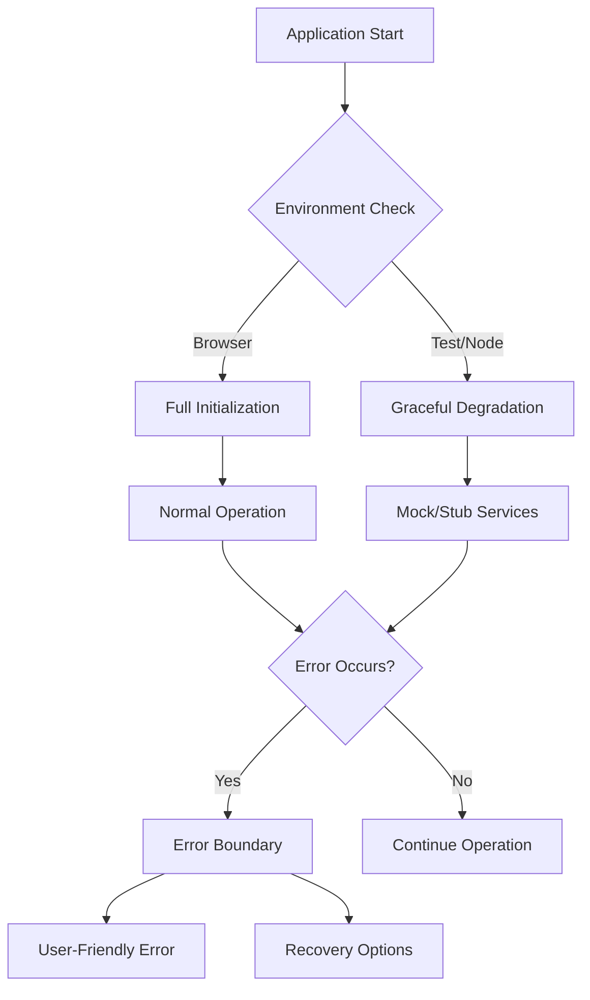

# Test Suite Stabilization Design

## Overview

This design addresses the critical test failures in the Azerbaijan Drug Database application by implementing robust error handling, consistent mocking strategies, and reliable state management. The solution focuses on making the application resilient to various runtime conditions while maintaining comprehensive test coverage.

## Architecture

### Error Handling Strategy



### State Management Flow


## Components and Interfaces

### 1. Environment Detection Service

**Purpose:** Detect runtime environment and provide appropriate fallbacks

**Interface:**
```typescript
interface EnvironmentService {
  isBrowser(): boolean
  isTest(): boolean
  isProduction(): boolean
  getWindowObject(): Window | null
  getLocationObject(): Location | MockLocation
}
```

**Implementation Strategy:**
- Check for `typeof window !== 'undefined'`
- Provide mock objects for test environments
- Gracefully degrade features when APIs are unavailable

### 2. Enhanced Error Boundary

**Purpose:** Catch and handle component rendering errors gracefully

**Interface:**
```typescript
interface ErrorBoundaryProps {
  fallback: (error: Error, retry: () => void) => ReactNode
  onError?: (error: Error, errorInfo: ErrorInfo) => void
  resetOnPropsChange?: boolean
}
```

**Implementation Strategy:**
- Wrap critical application sections
- Provide contextual error messages
- Offer recovery mechanisms (retry, refresh, reset state)
- Log errors for debugging

### 3. Robust URL State Management

**Purpose:** Handle URL state synchronization with comprehensive error handling

**Interface:**
```typescript
interface URLStateHook {
  urlState: ApplicationState
  updateURL: (partialState: Partial<ApplicationState>) => void
  replaceURL: (newState: ApplicationState) => void
  resetURL: () => void
  isValidURL: boolean
  errors: URLError[]
}
```

**Implementation Strategy:**
- Validate URL parameters before parsing
- Provide fallback values for invalid parameters
- Handle encoding/decoding errors gracefully
- Maintain state history for debugging

### 4. Mock Service Factory

**Purpose:** Provide consistent, realistic mock services for testing

**Interface:**
```typescript
interface MockServiceFactory {
  createSearchService(): SearchService
  createErrorLogger(): ErrorLogger
  createPerformanceMonitor(): PerformanceMonitor
  withDelay(ms: number): MockServiceFactory
  withError(errorType: string): MockServiceFactory
}
```

**Implementation Strategy:**
- Generate realistic test data
- Simulate various error conditions
- Support async operations with configurable delays
- Maintain consistency across test files

### 5. Performance Monitor with Environment Awareness

**Purpose:** Monitor performance without breaking in test environments

**Interface:**
```typescript
interface PerformanceMonitor {
  startMeasure(name: string, metadata?: object): void
  endMeasure(name: string, metadata?: object): void
  measureConcurrentFeature<T>(name: string, fn: () => T): T
  isAvailable(): boolean
}
```

**Implementation Strategy:**
- Check for browser APIs before using them
- Provide no-op implementations for test environments
- Store metrics safely with environment checks
- Handle errors without crashing the application

## Data Models

### Application State Model

```typescript
interface ApplicationState {
  searchText: string
  currentPage: number
  pageSize: number
  sortColumn: string | null
  sortDirection: 'asc' | 'desc'
  visibleColumns: Record<string, boolean>
  error: string | null
  loading: boolean
}
```

### URL Parameter Schema

```typescript
interface URLParameterSchema {
  [stateKey: string]: {
    param: string
    default: any
    encode: (value: any) => string | null
    decode: (value: string) => any
    validate: (value: any) => any
  }
}
```

### Test Configuration Model

```typescript
interface TestConfiguration {
  mockServices: boolean
  simulateErrors: boolean
  enablePerformanceMonitoring: boolean
  delayAsyncOperations: number
  environment: 'test' | 'development' | 'production'
}
```

## Error Handling

### Error Categories

1. **Initialization Errors**
   - Service unavailable
   - Configuration missing
   - Environment incompatibility

2. **Runtime Errors**
   - API failures
   - State synchronization issues
   - Component rendering failures

3. **URL State Errors**
   - Invalid parameters
   - Encoding/decoding failures
   - Browser history issues

4. **Test Environment Errors**
   - Mock service failures
   - Async operation timeouts
   - Environment setup issues

### Error Recovery Strategies

```typescript
enum ErrorRecoveryStrategy {
  RETRY = 'retry',
  RESET_STATE = 'reset_state',
  FALLBACK_UI = 'fallback_ui',
  GRACEFUL_DEGRADATION = 'graceful_degradation',
  USER_NOTIFICATION = 'user_notification'
}
```

### Error Handling Flow

1. **Detection:** Error boundaries and try-catch blocks
2. **Classification:** Determine error type and severity
3. **Logging:** Record error details for debugging
4. **Recovery:** Apply appropriate recovery strategy
5. **User Feedback:** Provide clear, actionable messages

## Testing Strategy

### Test Environment Setup

1. **Global Test Configuration**
   - Consistent mock implementations
   - Environment variable setup
   - Browser API polyfills

2. **Service Mocking Strategy**
   - Centralized mock factory
   - Realistic response data
   - Error simulation capabilities

3. **Component Testing Approach**
   - Isolated unit tests
   - Integration test scenarios
   - End-to-end user flows

### Test Categories

1. **Unit Tests**
   - Individual component behavior
   - Service function correctness
   - Utility function reliability

2. **Integration Tests**
   - Component interaction
   - State management flow
   - URL synchronization

3. **End-to-End Tests**
   - Complete user workflows
   - Error recovery scenarios
   - Cross-browser compatibility

### Mock Data Strategy

```typescript
interface MockDataGenerator {
  generateDrugData(count: number): DrugData[]
  generateSearchResponse(query: string): SearchResponse
  generateErrorResponse(type: ErrorType): ErrorResponse
  generateUserInteraction(type: InteractionType): UserEvent
}
```

## Performance Considerations

### Optimization Strategies

1. **Lazy Loading**
   - Component code splitting
   - Service initialization on demand
   - Mock data generation as needed

2. **Memory Management**
   - Cleanup on component unmount
   - Limit state history size
   - Clear performance metrics periodically

3. **Error Handling Performance**
   - Avoid expensive operations in error paths
   - Cache error recovery strategies
   - Minimize error boundary re-renders

### Monitoring and Metrics

1. **Test Performance Metrics**
   - Test execution time
   - Memory usage during tests
   - Mock service response times

2. **Application Performance Metrics**
   - Component render times
   - State update frequencies
   - URL synchronization delays

## Security Considerations

### Input Validation

1. **URL Parameter Validation**
   - Sanitize user input
   - Validate parameter formats
   - Prevent injection attacks

2. **State Validation**
   - Type checking for state values
   - Range validation for numeric values
   - Whitelist validation for enum values

### Error Information Disclosure

1. **Production Error Messages**
   - Generic user-friendly messages
   - Detailed logging for developers
   - No sensitive information exposure

2. **Test Environment Security**
   - Isolated test data
   - No production API calls
   - Secure mock implementations

## Implementation Phases

### Phase 1: Environment Detection and Error Boundaries
- Implement environment detection service
- Add comprehensive error boundaries
- Create fallback UI components

### Phase 2: URL State Management Hardening
- Enhance URL parameter validation
- Implement error recovery for URL parsing
- Add comprehensive state synchronization tests

### Phase 3: Mock Service Standardization
- Create centralized mock factory
- Standardize mock responses across tests
- Implement realistic error simulation

### Phase 4: Performance Monitoring Stabilization
- Add environment checks to performance code
- Implement graceful degradation for missing APIs
- Create test-safe performance monitoring

### Phase 5: Comprehensive Test Coverage
- Add missing integration tests
- Implement end-to-end test scenarios
- Create regression test suite

### Phase 6: Documentation and Maintenance
- Document error handling patterns
- Create troubleshooting guides
- Establish monitoring and alerting